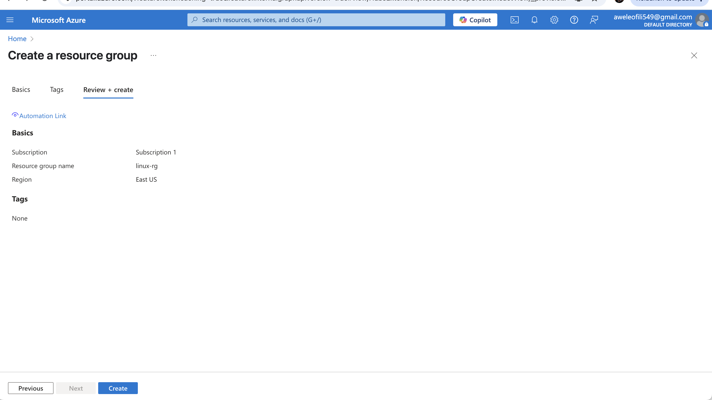
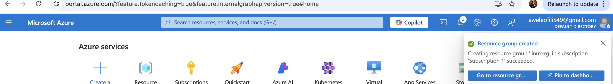

# AzureHandsOnProject
here i will be submitting my project on Azure

# INTRODUCTION
Cloud computing allows users to access powerful compute resources on demand. Microsoft Azure is one of the leading cloud platforms, and this project introduced me to its capabilities through hands on experience with deploying and managing Linux Virtual Machine. 

## PURPOSE OF THE PROJECT
To guide me through the process of creating a linux VM on Azure, connecting to it via SSH and exploring basic VM management operations like starting, stopping and resizing the VM using the Azure Portal. 

## OBJECTIVES OF THE PROJECT
1. Undestand the Azure Portal and resources organization.
2. Create and manage a Linux Virtual Machine in Azure.
3. Securely connect to the VM using SSH
4. Perform basic VM lifecycle management tasks.
5. Explore configuration opttions for compute resources. 

## PREREQUISITES
1. A valid Azure Subscription (Free Tier is acceptable)
2. A local SSH client (Linux/macOS terminal or PuTTY for windows)
3. Basic understanding of Linux commands and SSH access. 
4. Estimated Time: 1.5-2hours

## TASK OUTLINE
1. Set up Azure account and access the Azure Portal
2. Create a Resource Group for organizing related resources
3. Deploy a Linux Virtual Machine (Ubuntu or other preferred distro)
4. Configure authentication and networking
5. Connect to the VM using SSH.
6. Explore VM configuration and perform basic management tasks. 

# PROJECT TASKS
## TASK 1 - CREATE AN AZURE ACCOUNT AND ACCESS THE PORTAL.
The first thing i did was to visit the Azure signup page to create an account. the image below depicts this. 
i went ahead to log in and then navigated to the azure portal. 
the images below depicts this. 

## Task 2- create a resource group
in the portal. i searched for resource groups and clicked create. i went ahead to choose a name and select a region. i finally clicked on review + create and then created. the images below depicts this. 

## Task 3 - Create A Linux Virtual machine 
the first thing i had to do is to search for virtual machines in the Azure portal and clicked create. after which i filled out the basics tab
